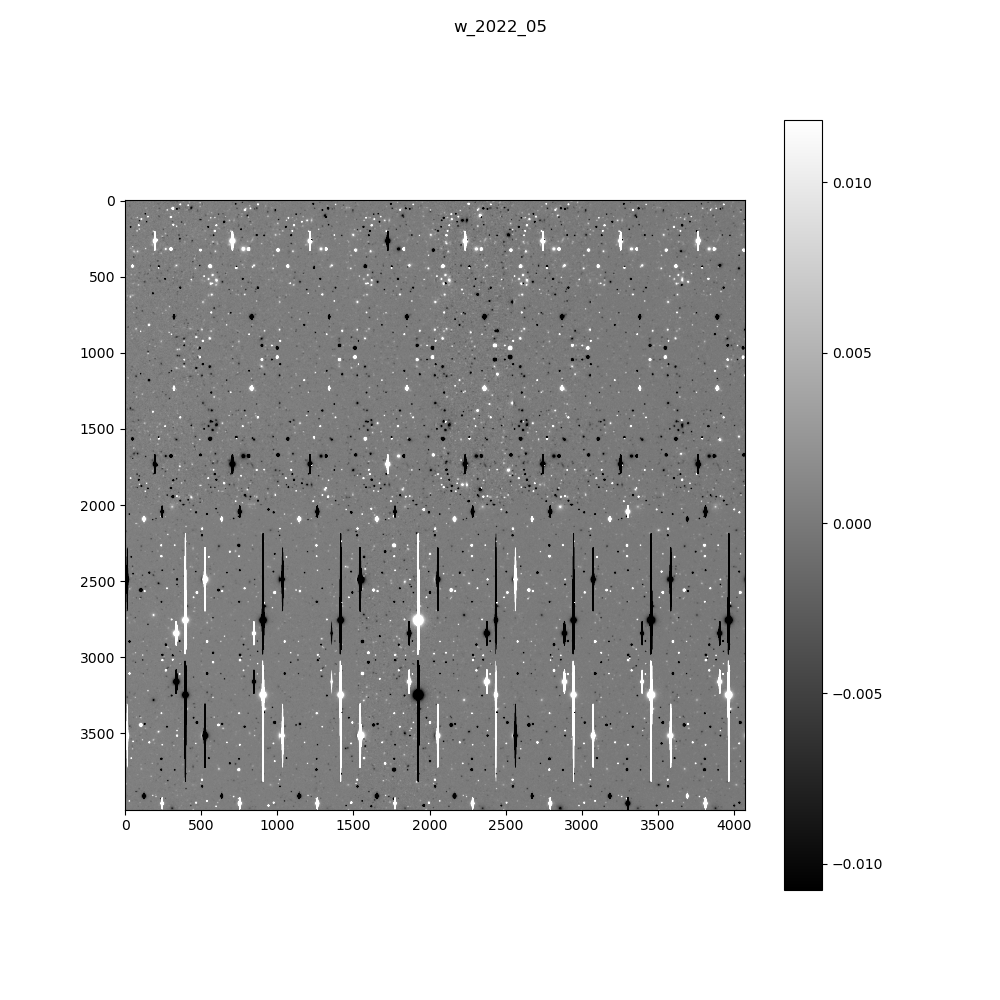
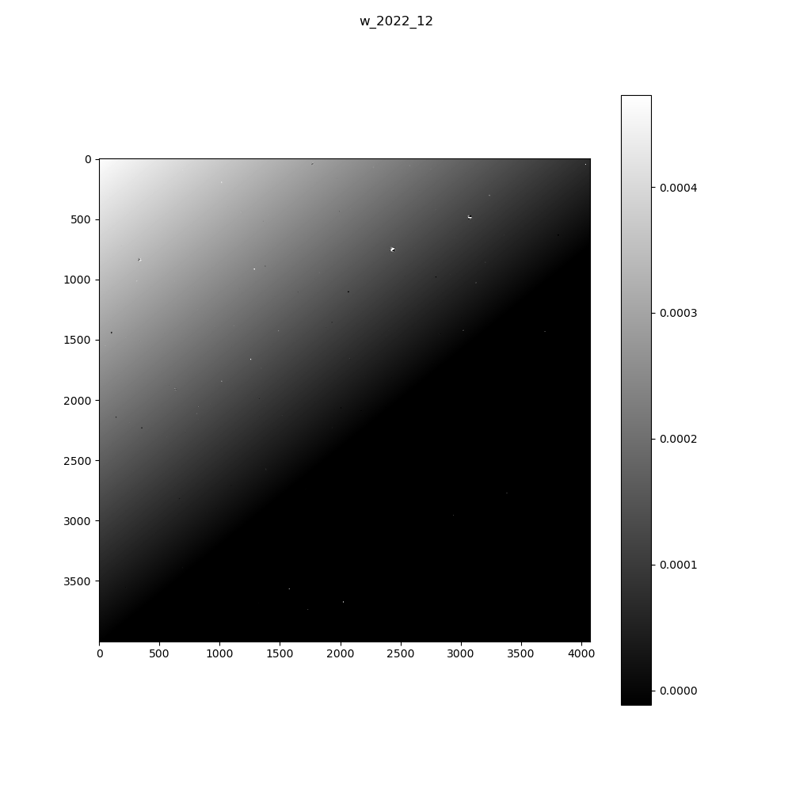
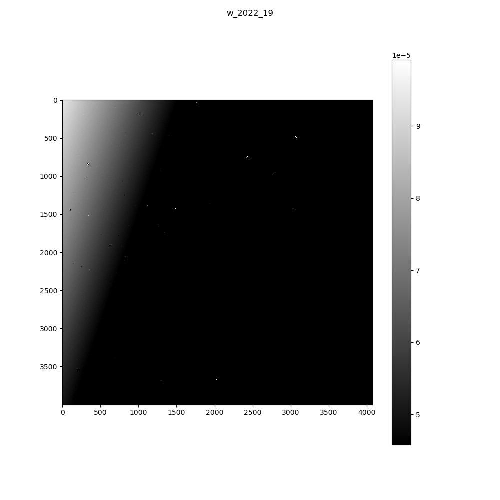
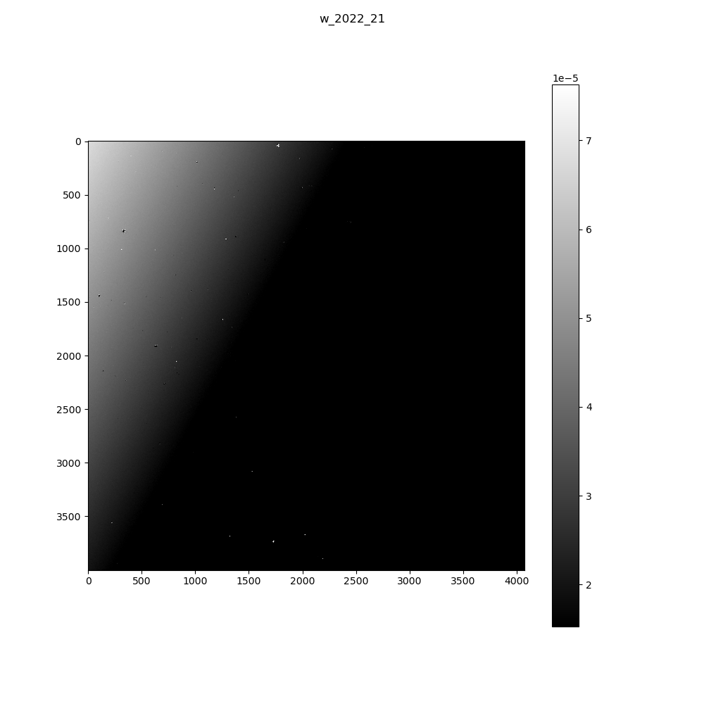
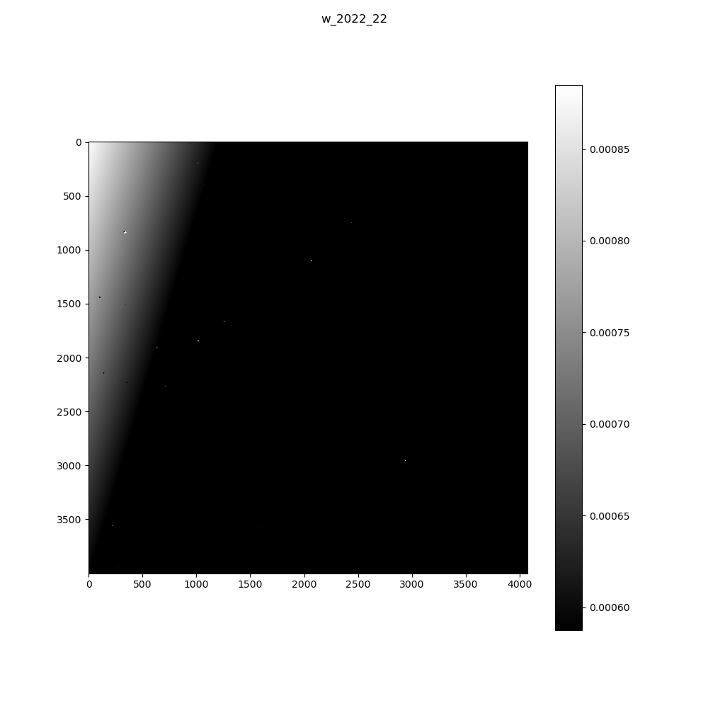

I used the two scripts in this folder to install various weekly builds of the stack, in search for the right one: the one that generates the same
calexps as the ones we have in DLDataset0.1.1.

## 1. Install the stack for a specific weekly build (and run the pipeline in it)
./install_single_stack.sh <weekly_build_number>

*IMPORTANT:* This should NOT be run inside an installed stack's environment, or the results are unpredictable.

Example:
./install_single_stack.sh w_2022_20

## 2. Visualize the comparison
./compare_calexps.py <weekly_build_number>

Example:
./compare_calexps.py w_2022_20

## Results
The process does not fit a notebook quite well, so I paste the results (the difference between the two calexps) here:

